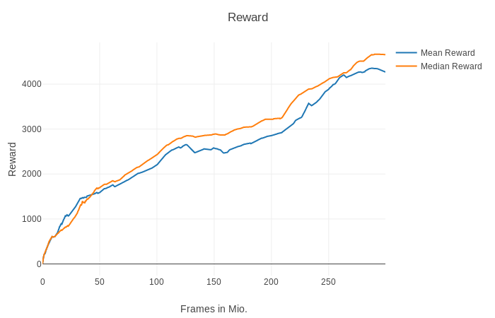
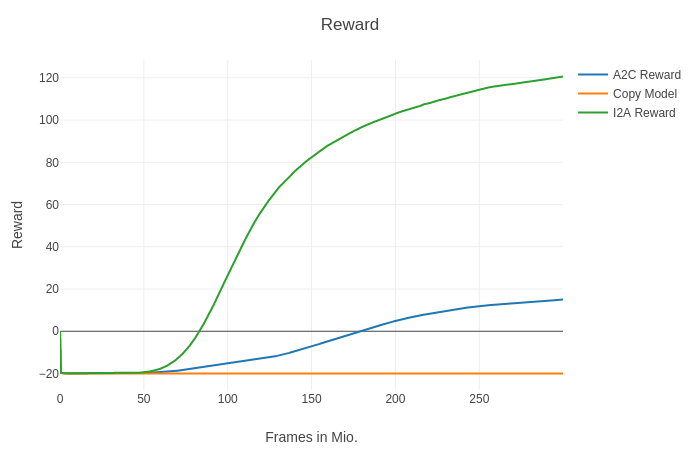
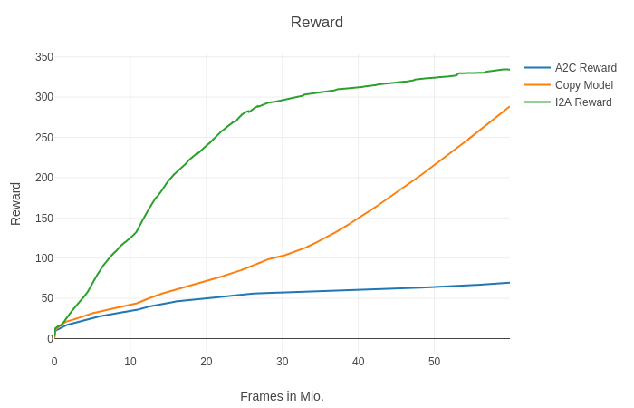

# Pytorch Latent I2A

This is a PyTorch implementation of
* Imagination Augmented Agent (I2A) [I2A](https://arxiv.org/abs/1707.06203)
* Latent Space Imagination Augmented Agent, based on [LatentI2A](https://arxiv.org/pdf/1802.03006.pdf)

This repository is based on a fork of the pytorch-a2c-ppo-acktr repository by Ilya Kostrikov ([https://github.com/ikostrikov/pytorch-a2c-ppo-acktr](https://github.com/ikostrikov/pytorch-a2c-ppo-acktr)).

To cite our work please use the following bibtex:
```bash
@misc{repo,
  author = {Florian Klemt, Angela Denninger},
  title = {Pytorch Latent I2A},
  publisher = {GitHub},
  journal = {GitHub repository},
  howpublished = {\url{https://github.com/FlorianKlemt/pytorch-latent-i2a.git}},
  urldate = {2018-10-18}
}
```

# Requires:
* Python 3
* [PyTorch](http://pytorch.org/), tested with version 0.4.1
* [Visdom](https://github.com/facebookresearch/visdom)
* To use MiniPacman environments you also need to download and install the gym-minipacman repo [MiniPacman](https://github.com/FlorianKlemt/gym-minipacman).

In order to install MiniPacman run:
```bash
# MiniPacman
git clone https://github.com/FlorianKlemt/gym-minipacman.git
cd gym-minipacman
pip3 install -e .
```

# Reproducing our results:
## MiniPacman
### Train A2C on MiniPacman Hunt:
```bash
python3 main.py --env-name HuntMiniPacmanNoFrameskip-v0 --algo a2c --entropy-coef 0.02 --num-stack 1 --num-processes 32
```

### Train environment model for MiniPacman Hunt:
Requires a pretrained A2C model, or the flag '--no-policy-model-loading'.
```bash
python3 main_train_environment_model.py --env-name HuntMiniPacmanNoFrameskip-v0 --environment-model MiniModelLabels --lr 1e-4 --save-interval 100 --batch-size 100
```

### Train Classic I2A on MiniPacman Hunt:
Requires pretrained environment model.
```bash
python3 main.py --env-name HuntMiniPacmanNoFrameskip-v0 --algo i2a --environment-model MiniModelLabels --log-interval 10 --num-processes 64 --num-stack 1 --distill-coef 10 --entropy-coef 0.02
```

### Train Classic I2A Copy Model on MiniPacman Hunt:
The copy model has the same number of weights as the I2A model, but does not imagine the future. Therefore it does not need an environment model.
```bash
python3 main.py --environment-model CopyModel --env-name HuntMiniPacmanNoFrameskip-v0 --algo i2a --log-interval 10 --num-processes 32 --num-stack 1 --distill-coef 10 --entropy-coef 0.02
```

## MsPacman
### Train A2C on MsPacman:
```bash
python3 main.py --env-name MsPacmanNoFrameskip-v0 --algo a2c --train-on-200x160-pixel --entropy-coef 0.01 --num-stack 4 --num-processes 8
```
### Train Latent Space Environment Models for MsPacman:
Requires a pretrained A2C model, or the flag '--no-policy-model-loading'.
```bash
python3 main_train_environment_model.py --env-name MsPacmanNoFrameskip-v0 --environment-model dSSM_DET --lr 0.0001 --weight-decay 0 --batch-size 30 --sample-memory-size 100 --rollout-steps 10
python3 main_train_environment_model.py --env-name MsPacmanNoFrameskip-v0 --environment-model dSSM_VAE --lr 0.0001 --weight-decay 0 --batch-size 15 --sample-memory-size 50 --rollout-steps 10
python3 main_train_environment_model.py --env-name MsPacmanNoFrameskip-v0 --environment-model sSSM --lr 0.0001 --weight-decay 0 --batch-size 5 --sample-memory-size 20 --rollout-steps 10
```

### Train Latent Space I2A on MsPacman:
Requires a pretrained latent space environment model.
```bash
python3 main.py --env-name MsPacmanNoFrameskip-v0 --algo i2a --distill-coef 10 --entropy-coef 0.01 --num-stack 4 --num-processes 8 --environment-model dSSM_DET
```

# Visdom server
To see a visualization of the training curves during training, start a visdom server via
```bash
python3 -m visdom.server -p xxxx
```
The default port used both by visdom and our code is 8097.

# Use pretrained models
To continue training on a pretrained model use the '--load-model' flag. The model must lie in the folder specified via the '--save-dir' flag (default='./trained_models/'). I2A models must lie under the subfolder '/i2a/', A2C models must lie under the subfolder '/a2c/'. The file must be named the same as the environment name with file-ending '.pt'.

Example:
```bash
python3 main.py --env-name MsPacmanNoFrameskip-v0 --algo i2a --distill-coef 10 --entropy-coef 0.01 --num-stack 4 --num-processes 8 --environment-model dSSM_DET --load-model
```
loads the model under './trained_models/i2a/MsPacmanNoFrameskip-v0.pt'. The --algo, --num-stack and --environment-model arguments must be the same as used in the loaded model.

To play with a pretrained model without continuing to train use the '--no-training' flag.

Example:
```bash
python3 main.py --env-name MsPacmanNoFrameskip-v0 --algo i2a --num-stack 4 --num-processes 8 --environment-model dSSM_DET --no-training
```

# Results
### I2A with a dSSM-DET model on MsPacmanNoFrameskip-v0


### Hunt MiniPacman (HuntMiniPacmanNoFrameskip-v0)


### Regular MiniPacman (RegularMiniPacmanNoFrameskip-v0)



